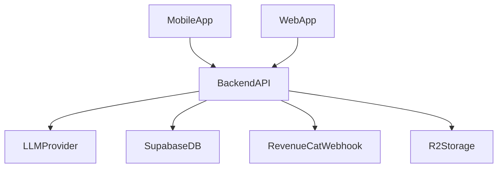
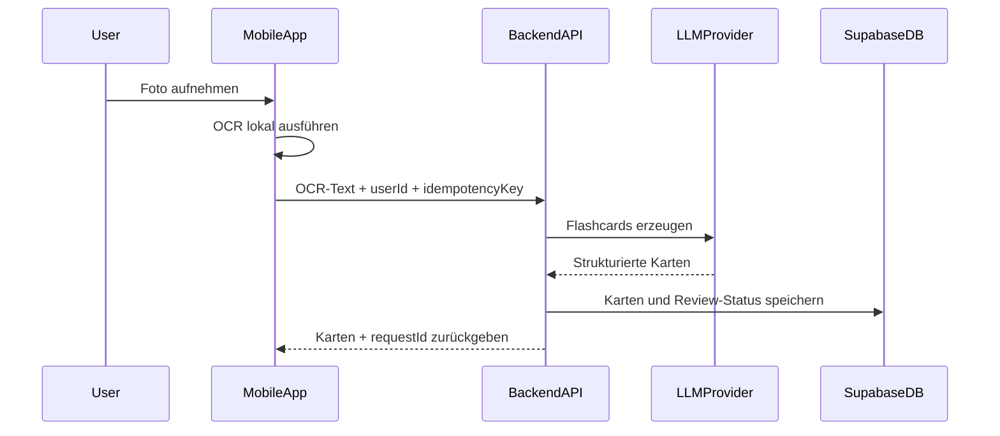

# clearn.ai

**Foto → KI → Auswendig lernen.** Eine mobile App, die beliebige Inhalte per Kamera erfasst, mittels KI in strukturierte Lernmaterialien verwandelt und durch Spaced Repetition dauerhaft im Gedächtnis verankert.

---

## Inhaltsverzeichnis

- [Vision & Kernkonzept](#vision--kernkonzept)
- [Warum wir eine API brauchen](#warum-wir-eine-api-brauchen)
- [Produktfokus & MVP-Abgrenzung](#produktfokus--mvp-abgrenzung)
- [Erfolgsmessung (KPIs)](#erfolgsmessung-kpis)
- [Datenschutz, Compliance & Sicherheit](#datenschutz-compliance--sicherheit)
- [Features](#features)
- [Technische Architektur](#technische-architektur)
- [Tech Stack](#tech-stack)
- [Kostenübersicht](#kostenübersicht)
- [Datenmodell](#datenmodell)
- [API-Struktur](#api-struktur)
- [KI-Qualitaetssicherung](#ki-qualitaetssicherung)
- [Offline- & Sync-Strategie](#offline--sync-strategie)
- [Betrieb & Servicequalitaet](#betrieb--servicequalitaet)
- [Teststrategie](#teststrategie)
- [Spaced Repetition (FSRS)](#spaced-repetition-fsrs)
- [Monetarisierung](#monetarisierung)
- [Entwicklungs-Roadmap](#entwicklungs-roadmap)
- [Backlog (Detailplanung)](#backlog-detailplanung)
- [Warum clearn.ai? — Alleinstellungsmerkmale (USPs)](#warum-clearnai--alleinstellungsmerkmale-usps)
- [Implementierungsstatus (2026-02-11)](#implementierungsstatus-2026-02-11)
- [Risiken & Gegenmassnahmen](#risiken--gegenmassnahmen)
- [Setup & Entwicklung](#setup--entwicklung)
- [Projektstruktur](#projektstruktur)
- [Lizenz](#lizenz)

---

## Vision & Kernkonzept

```
📸 Foto aufnehmen
    ↓
🔍 On-Device OCR (sofort, kostenlos, offline)
    ↓
🤖 KI-Strukturierung (Cloud)
    ↓
📚 Lernkarten, Quizzes, Zusammenfassungen
    ↓
🧠 FSRS Spaced Repetition
    ↓
✅ Dauerhaft gelernt
```

**Zielgruppe:** Alle Altersgruppen — Schüler, Studenten, Berufstätige, Lifelong Learners  
**Primärmarkt:** DACH (Deutschland, Österreich, Schweiz)  
**Kernversprechen:** Vom Foto zum Wissen in unter 30 Sekunden

---

## Warum clearn.ai? — Alleinstellungsmerkmale (USPs)

| USP | Beschreibung | Wettbewerb |
|-----|-------------|------------|
| **Kamera → KI → Flashcards** | Foto aufnehmen → Gemini analysiert → fertige Lernkarten in Sekunden | Kein Wettbewerber bietet diesen End-to-End-Flow |
| **Bild-Input für KI** | Auch handschriftliche Notizen, Tafelbilder, Lehrbuchseiten werden erkannt | Quizlet: nur Text-AI; Anki: keine KI |
| **FSRS v5 Algorithmus** | Wissenschaftlich optimaler Spaced-Repetition-Algorithmus | Quizlet: einfaches SRS; Brainscape: eigener Algorithmus |
| **KI-generierte Titel** | Deck-Titel passend zum Inhalt (nicht "Deck 1") | Kein Wettbewerber |
| **Kostenlos starten, kein Abo nötig** | Kernfunktionen kostenlos, KI-Scans mit Fair-Use-Limit | Quizlet: Abo für KI; Anki iOS: 25 $ einmalig |

### Wettbewerber im Überblick

- **Quizlet** — Größte Community, polierte UI, 8 Lernmodi, aber: einfaches SRS, KI nur bezahlt, Werbung
- **Anki** — Bester Algorithmus, maximale Flexibilität, aber: veraltete UI, steile Lernkurve, iOS-App kostet 25 $
- **Brainscape** — Gute Analytics, Confidence-basiert, aber: wenig Free-Content, eingeschränkt offline

**clearn.ai positioniert sich als:** Anki-Qualität (FSRS) + Quizlet-UX + KI-First (Kamera → Karten).

---

## Warum wir eine API brauchen

Kurzfassung: Die API ist der **sichere Serverteil**.  
Die App macht alles, was lokal schnell ist (Kamera, OCR, Lernen).  
Die API macht alles, was sicher, verbindlich oder zentral sein muss.

### Ohne API wäre problematisch

- KI- und Zahlungs-Keys müssten in die App (unsicher)
- Limits/Paywall könnten clientseitig umgangen werden
- Sync-Konflikte und Duplikate wären schwer robust zu lösen
- Webhooks (z. B. RevenueCat) könnten nicht sauber verarbeitet werden

### Mit API ist die Aufgabenteilung klar



### Typischer Scan-Flow (einfach)



### Merksatz

**Alles was Schlüssel, Abrechnung, Limits, Sync und verlässliche Daten betrifft, gehört in die API.**  
Darum bleibt die App schnell und die Plattform trotzdem sicher und skalierbar.

---

## Produktfokus & MVP-Abgrenzung

### Produktentscheidung (aktuell)

- **Produktname:** clearn.ai (einheitlich in App, Repository, Domain und App-Store-Auftritt)
- **Plattform:** Mobile first (iOS/Android mit Expo), Web nur als spätere Ergänzung
- **Sprachen:** Default **Deutsch**, erste Übersetzung **Englisch** (UI, Prompts, E-Mails, Push)

### MVP-Scope (8-10 Wochen)

| Bereich | Must-have (MVP) | Nach MVP |
|--------|-------------------|----------|
| Erfassung | Kamera + Galerie-Import | Whiteboard-Modus, PDF-Import |
| Verständnis | On-Device OCR + manuelle Korrektur | Handschrift-Finetuning |
| KI-Output | Flashcards (basic + cloze) | MCQ, Matching, Longform-Zusammenfassung |
| Lernen | FSRS Reviews, tägliche Session | Gamification, Leaderboards |
| Daten | Supabase Auth, Decks, Karten, Review-Logs | Community-Decks, B2B-Klassen |
| Offline | Lokaler Cache + Retry-Queue | Vollständige Offline-Erstellung mit späterem Merge |
| Monetarisierung | Basis Paywall + RevenueCat | Experimentelle Paywall-Varianten |

### Nicht-Ziele im MVP

- Keine Community-Decks und kein Social Sharing
- Kein B2B-Adminbereich
- Kein Mathpix/Formula-Flow
- Keine Web-App als primärer Lernclient

---

## Erfolgsmessung (KPIs)

### North Star Metric

**Wöchentliche, erfolgreich abgeschlossene Reviews pro aktivem Nutzer**

### Führende Produktmetriken

| Metrik | Zielwert (Beta) | Warum relevant |
|-------|------------------|----------------|
| Time to First Card | < 30 Sekunden | Kernversprechen "Foto zu Wissen" |
| OCR->Karte Erfolgsrate | > 95% | Prozessstabilität |
| Karten-Akzeptanzrate (ohne Edit) | > 70% | KI-Qualität |
| Erstes Lernset am Tag 0 abgeschlossen | > 60% | Aktivierung |
| D7 Retention | > 25% | Produktbindung |
| Review Completion Rate | > 65% | Lernwirksamkeit |
| Crash-Free Sessions (Mobile) | > 99,5% | technische Qualität |

### Business-Metriken

| Metrik | Zielwert (Startphase) |
|-------|------------------------|
| Free -> Trial Conversion | > 8% |
| Trial -> Paid Conversion | > 35% |
| Monatlicher Churn (Paid) | < 8% |
| Rückerstattungsquote | < 3% |

---

## Datenschutz, Compliance & Sicherheit

### Datenschutz & DSGVO (MVP-Mindeststandard)

- **Rechtsgrundlagen:** Vertragserfüllung (Lernfunktion), berechtigtes Interesse (Betrieb), Einwilligung (Analytics/Marketing)
- **Auftragsverarbeitung:** AV-Verträge mit Supabase, Vercel, LLM-Anbieter, Sentry, PostHog, RevenueCat
- **Datenminimierung:** Bilder optional, OCR-Text nur zweckgebunden; Löschfristen für Rohdaten
- **Betroffenenrechte:** Export, Berichtigung, Löschung direkt in der App auslösbar
- **Aufbewahrung:** Scan-Rohdaten mit TTL; Lernhistorie getrennt von Bilddaten
- **Minderjährige:** gesonderte Hinweise und eingeschränkte Tracking-Defaults

### Sicherheitsbaseline

- Supabase Row Level Security als Standard auf allen Nutzer-Tabellen
- Kurzlebige Signed URLs für Bildzugriffe (kein öffentliches Bucket als Standard)
- Serverseitige Rate Limits pro Nutzer/Plan und Missbrauchserkennung
- Secrets nur serverseitig; keine API-Keys im Mobile Bundle
- Security Logging und Alerting für Auth-Anomalien und ungewöhnliche Scan-Spitzen

### Governance-Artefakte (sollten parallel gepflegt werden)

- Verzeichnis von Verarbeitungstätigkeiten
- TOMs (technische und organisatorische Maßnahmen)
- Incident-Response-Playbook inkl. Meldeprozess

---

## Features

### MVP (v1.0)

- **Kamera-Capture:** Foto aufnehmen oder aus Galerie importieren
- **OCR:** On-Device-Texterkennung (Apple Vision / Google ML Kit)
- **KI-Flashcards:** Automatische Generierung von Frage-Antwort-Paaren (basic + cloze)
- **Spaced Repetition:** FSRS-Algorithmus für optimale Wiederholungsintervalle
- **Deck-Verwaltung:** Decks, Tags, Suche (Basis)
- **Offline-Basis:** Lernen ohne Internet, Upload/Sync via Retry-Queue
- **Auth:** E-Mail/Passwort + Apple/Google Sign-In
- **Paywall-Basis:** Free/Pro via RevenueCat

### v1.1

- **Multiple Lernmodi:** Flashcards, Multiple-Choice, Lückentext, Zuordnung
- **KI-Zusammenfassungen:** Kompakte Zusammenfassungen aus langen Texten
- **Handschrift-Korrektur-UI:** Inline-Editor für OCR-Fehler
- **Statistiken:** Lernfortschritt, Streaks, Retention-Rate
- **Push-Notifications:** Lern-Erinnerungen

### v2.0

- **PDF/Dokument-Import:** Mehrseitige Dokumente verarbeiten
- **Formel-Erkennung:** Mathpix-Integration für STEM-Inhalte
- **Whiteboard-Modus:** Optimierte Erfassung von Whiteboard-Fotos
- **Sharing:** Decks teilen, Community-Bibliothek
- **Anki-Export:** .apkg-Export für Power-User
- **Web-App:** Ergänzende Next.js Web-Version

### v3.0

- **B2B/Schul-Dashboard:** Admin-Panel, Klassen, Fortschrittstracking
- **Audio-Karten:** TTS für Sprachlernen
- **Multi-Device-Sync:** Echtzeit-Synchronisation
- **Gamification:** XP, Badges, Leaderboards

---

## Technische Architektur

```
┌─────────────────────────────────────────────────────┐
│                    MOBILE APP                        │
│              (React Native / Expo)                   │
│                                                     │
│  ┌───────────┐  ┌───────────┐  ┌────────────────┐  │
│  │  Kamera   │  │ On-Device │  │  FSRS Engine   │  │
│  │  Capture  │→ │   OCR     │  │  (ts-fsrs)     │  │
│  └───────────┘  └─────┬─────┘  └────────────────┘  │
│                       │                              │
└───────────────────────┼──────────────────────────────┘
                        │ Extracted Text
                        ▼
┌─────────────────────────────────────────────────────┐
│                  BACKEND API                         │
│            (Next.js API Routes / Vercel)             │
│                                                     │
│  ┌───────────┐  ┌───────────┐  ┌────────────────┐  │
│  │   Auth    │  │    KI     │  │   Rate Limit   │  │
│  │ (Clerk /  │  │ Processing│  │   & Billing    │  │
│  │  Supabase)│  │ (LLM API) │  │                │  │
│  └───────────┘  └───────────┘  └────────────────┘  │
│                                                     │
└──────────┬──────────────┬───────────────┬───────────┘
           │              │               │
           ▼              ▼               ▼
    ┌────────────┐ ┌────────────┐  ┌────────────┐
    │  Supabase  │ │    S3 /    │  │  Gemini /  │
    │ PostgreSQL │ │ Cloudflare │  │  OpenAI    │
    │  (Daten)   │ │  R2 (Imgs) │  │  (LLM API) │
    └────────────┘ └────────────┘  └────────────┘
```

### Warum diese Architektur?

- **On-Device OCR first:** Keine API-Kosten, sofortige Ergebnisse, DSGVO-konform
- **Vercel für Backend:** Passt in den bestehenden Workflow, serverless, auto-scaling
- **Supabase statt eigenes Auth/DB:** Spart Monate Entwicklungszeit, hat Row Level Security, Realtime, Auth built-in
- **S3/R2 für Bilder:** Günstigster Speicher, R2 hat keine Egress-Kosten
- **Offline-Queue + Sync:** Stabile UX bei schlechter Verbindung, keine verlorenen Reviews

---

## Tech Stack

### Mobile App
| Komponente | Technologie | Begründung |
|-----------|------------|------------|
| Framework | **React Native + Expo** | Ein Codebase für iOS + Android; Expo für OTA-Updates |
| OCR (iOS) | **Apple Vision Framework** | Kostenlos, offline, schnell, gute Deutsch-Unterstützung |
| OCR (Android) | **Google ML Kit** | Kostenlos, offline, on-device |
| Navigation | **Expo Router** | File-based routing wie Next.js |
| State | **Zustand** | Leichtgewichtig, TypeScript-native |
| Local DB | **WatermelonDB** oder **SQLite (expo-sqlite)** | Offline-first, schnelle Queries für Karten |
| SRS Engine | **ts-fsrs** | TypeScript-Implementierung von FSRS v5 |
| i18n | **i18next + react-i18next** | Deutsch als Default, Englisch als erste Übersetzung |
| UI | **Tamagui** oder **NativeWind** | Cross-Platform UI mit Native Performance |
| Testing | **Vitest + Playwright + Detox (optional)** | Unit + API/E2E + Mobile-Flows |

### Backend & Infrastruktur
| Komponente | Technologie | Begründung |
|-----------|------------|------------|
| API | **Next.js API Routes auf Vercel** | Bestehender Workflow, serverless |
| Datenbank | **Supabase (PostgreSQL)** | Auth + DB + Realtime + Storage in einem |
| Bild-Speicher | **Cloudflare R2** oder **Supabase Storage** | R2: S3-kompatibel, kein Egress; Supabase: einfacher |
| Auth | **Supabase Auth** | Social Login, Magic Links, RLS integration |
| KI-API | **Google Gemini 2.5 Flash** (Standard) | Bestes Preis-Leistungs-Verhältnis für Vision+Text |
| KI-API (Fallback) | **OpenAI GPT-4o Mini** | Alternative bei Gemini-Ausfällen |
| Formel-OCR | **Mathpix API** (v2.0) | Spezialist für STEM; $0,002/Bild |
| Push | **Expo Push Notifications** | Kostenlos, integriert |
| Analytics | **PostHog** (Self-hosted oder Cloud) | DSGVO-konform, Product Analytics |
| Payments | **RevenueCat** | In-App-Purchases für iOS/Android, Subscription-Management |
| Error Tracking | **Sentry** | Crash Reporting für React Native |

---

## Kostenübersicht

### Einmalige Kosten

| Posten | Kosten | Anmerkung |
|--------|--------|-----------|
| Apple Developer Account | **€99/Jahr** | Pflicht für iOS App Store |
| Google Play Developer | **€25 einmalig** | Pflicht für Play Store |
| Domain clearn.ai | **~€30–50/Jahr** | .ai Domain |
| Design/Branding | **€0–2.000** | Je nach DIY vs. Designer |
| **Gesamt einmalig** | **~€150–2.200** | |

### Monatliche Fixkosten (MVP-Phase, 0–1.000 Nutzer)

| Service | Free Tier | Geschätzte Kosten | Anmerkung |
|---------|-----------|-------------------|-----------|
| **Vercel** (Backend) | 100 GB BW, Serverless | **€0** (Pro: €20) | Hobby reicht für MVP |
| **Supabase** (DB + Auth) | 500 MB DB, 50K MAU | **€0** (Pro: €25) | Free reicht für Start |
| **Cloudflare R2** (Bilder) | 10 GB Storage, 10M Reads | **€0–5** | Kein Egress! |
| **Gemini API** (KI) | Großzügiges Free Tier | **€0–20** | Flash ist extrem günstig |
| **Sentry** (Errors) | 5K Events/Monat | **€0** | Free reicht für Start |
| **PostHog** (Analytics) | 1M Events/Monat | **€0** | Free Tier sehr großzügig |
| **RevenueCat** (Payments) | $2.500 MTR | **€0** | Erst ab Umsatz kostenpflichtig |
| **Expo EAS** (Builds) | 30 Builds/Monat | **€0** (Prod: €99) | Free reicht für Entwicklung |
| **Gesamt MVP** | | **~€0–50/Monat** | Fast alles im Free Tier! |

### Skalierte Kosten (1.000–10.000 aktive Nutzer)

| Service | Geschätzte Kosten/Monat | Berechnung |
|---------|------------------------|------------|
| **Vercel Pro** | **€20** | Reicht für ~100K API-Calls/Tag |
| **Supabase Pro** | **€25** | 8 GB DB, 100K MAU, Daily Backups |
| **Cloudflare R2** | **€5–15** | ~50 GB Bilder, Class A/B Ops |
| **Gemini Flash API** | **€30–100** | ~500K Anfragen × $0,0001–0,0003 |
| **Expo EAS Production** | **€99** | Unlimitierte Builds + Updates |
| **Sentry Team** | **€26** | 50K Events |
| **PostHog** | **€0** | Noch im Free Tier |
| **RevenueCat** | **€0–120** | 1,2% ab $2.500 MTR |
| **Gesamt** | **~€200–400/Monat** | |

### Skalierte Kosten (10.000–100.000 aktive Nutzer)

| Service | Geschätzte Kosten/Monat | Berechnung |
|---------|------------------------|------------|
| **Vercel Pro** | **€20–150** | Ggf. zusätzliche Serverless-Kosten |
| **Supabase Team** | **€599** | Großere DB, SOC2, Priority Support |
| **Cloudflare R2** | **€30–80** | 200–500 GB Storage |
| **Gemini Flash API** | **€200–800** | 2–5 Mio. Anfragen/Monat |
| **Mathpix** (v2.0) | **€100–300** | STEM-Nutzer, $0,002/Bild |
| **Expo EAS** | **€99** | |
| **Sentry Business** | **€80** | |
| **PostHog** | **€0–450** | Je nach Event-Volumen |
| **RevenueCat** | **€200–800** | 1,2% vom Umsatz |
| **Gesamt** | **~€1.300–3.300/Monat** | |

### Kosten pro Nutzer (Unit Economics)

| Nutzungsniveau | API + Infra / Nutzer / Monat | Bei Abo-Preis €7,99 |
|---------------|------------------------------|---------------------|
| Leicht (50 Fotos) | **€0,03–0,08** | 99% Marge |
| Mittel (200 Fotos) | **€0,08–0,25** | 97% Marge |
| Intensiv (500 Fotos) | **€0,20–0,60** | 93% Marge |
| Power (1.000+ Fotos) | **€0,50–2,00** | 75–94% Marge |

> **Kernaussage:** Die Infrastrukturkosten sind extrem niedrig. Der On-Device-OCR-Ansatz spart ~90% der Verarbeitungskosten. Gemini Flash ist das günstigste multimodale Modell am Markt. Bei €7,99/Monat Abo bleiben selbst bei Power-Usern >75% Bruttomarge.

### Noch zu berücksichtigende Kostenblöcke (oft unterschätzt)

| Kostenblock | Typischer Effekt |
|------------|------------------|
| Apple/Google Store Fees | 15-30% auf In-App-Umsatz |
| Zahlungsabwicklung/Refunds | Senkt Nettomarge um 2-5% |
| Support & Moderation | Steigt stark mit Community-Features |
| Fraud/Abuse (Bots, Abo-Missbrauch) | Zusätzliche Infra- und Ops-Kosten |
| Compliance & Recht | Initial hoher Einmalaufwand + laufende Pflege |

### Kostenvergleich: S3 vs. Cloudflare R2 vs. Supabase Storage

| | AWS S3 | Cloudflare R2 | Supabase Storage |
|--|--------|---------------|-----------------|
| Storage/GB | $0,023 | $0,015 | $0,021 |
| Egress/GB | **$0,09** | **€0 (!)** | $0,09 |
| PUT/1000 | $0,005 | $0,0045 | Inkludiert |
| GET/1000 | $0,0004 | $0,0036 | Inkludiert |
| **100 GB + 500 GB Egress** | **~$47/Mo** | **~$1,50/Mo** | **~$47/Mo** |
| Empfehlung | ❌ Teuer bei Egress | ✅ **Beste Wahl** | ⚠️ Einfacher, aber teurer |

> **Empfehlung: Cloudflare R2** — S3-kompatible API, dramatisch günstiger durch 0 Egress-Kosten. Bei einer Foto-App mit vielen Bildzugriffen spart das hunderte Euro/Monat.

---

## Datenmodell

```sql
-- Supabase PostgreSQL Schema

-- Benutzer (erweitert Supabase Auth)
CREATE TABLE profiles (
  id UUID PRIMARY KEY REFERENCES auth.users(id),
  display_name TEXT,
  avatar_url TEXT,
  subscription_tier TEXT DEFAULT 'free', -- free | pro | lifetime
  subscription_expires_at TIMESTAMPTZ,
  monthly_scan_count INT DEFAULT 0,
  scan_count_reset_at TIMESTAMPTZ,
  preferred_language TEXT DEFAULT 'de',
  locale TEXT DEFAULT 'de-DE',
  timezone TEXT DEFAULT 'Europe/Berlin',
  created_at TIMESTAMPTZ DEFAULT now(),
  updated_at TIMESTAMPTZ DEFAULT now()
);

-- Decks (Kartenstapel)
CREATE TABLE decks (
  id UUID PRIMARY KEY DEFAULT gen_random_uuid(),
  user_id UUID REFERENCES profiles(id) ON DELETE CASCADE,
  title TEXT NOT NULL,
  description TEXT,
  tags TEXT[],
  card_count INT DEFAULT 0,
  is_public BOOLEAN DEFAULT false,
  cover_image_url TEXT,
  deleted_at TIMESTAMPTZ,
  created_at TIMESTAMPTZ DEFAULT now(),
  updated_at TIMESTAMPTZ DEFAULT now()
);

-- Karten
CREATE TABLE cards (
  id UUID PRIMARY KEY DEFAULT gen_random_uuid(),
  deck_id UUID REFERENCES decks(id) ON DELETE CASCADE,
  user_id UUID REFERENCES profiles(id) ON DELETE CASCADE,
  
  -- Inhalte
  front TEXT NOT NULL,          -- Frage
  back TEXT NOT NULL,            -- Antwort
  card_type TEXT DEFAULT 'basic', -- basic | cloze | mcq | matching
  extra_data JSONB,              -- MCQ-Optionen, Cloze-Hints etc.
  source_image_url TEXT,         -- Original-Foto (R2)
  source_text TEXT,              -- Extrahierter OCR-Text
  source_scan_id UUID,
  ai_model TEXT,
  
  -- FSRS-Daten (auf Device + Server gespiegelt)
  fsrs_stability FLOAT DEFAULT 0,
  fsrs_difficulty FLOAT DEFAULT 0,
  fsrs_due TIMESTAMPTZ DEFAULT now(),
  fsrs_last_review TIMESTAMPTZ,
  fsrs_reps INT DEFAULT 0,
  fsrs_lapses INT DEFAULT 0,
  fsrs_state TEXT DEFAULT 'new', -- new | learning | review | relearning
  
  deleted_at TIMESTAMPTZ,
  created_at TIMESTAMPTZ DEFAULT now(),
  updated_at TIMESTAMPTZ DEFAULT now()
);

-- Lern-Sessions (für Statistiken)
CREATE TABLE review_logs (
  id UUID PRIMARY KEY DEFAULT gen_random_uuid(),
  card_id UUID REFERENCES cards(id) ON DELETE CASCADE,
  user_id UUID REFERENCES profiles(id) ON DELETE CASCADE,
  idempotency_key TEXT NOT NULL,
  rating INT NOT NULL, -- 1=Again, 2=Hard, 3=Good, 4=Easy
  review_duration_ms INT,
  reviewed_at TIMESTAMPTZ DEFAULT now()
);

-- Scan-Historie
CREATE TABLE scans (
  id UUID PRIMARY KEY DEFAULT gen_random_uuid(),
  user_id UUID REFERENCES profiles(id) ON DELETE CASCADE,
  image_url TEXT NOT NULL,
  extracted_text TEXT,
  ai_response JSONB,          -- Generierte Karten, Zusammenfassung etc.
  ai_model TEXT,
  status TEXT DEFAULT 'processed', -- pending | processed | failed
  error_code TEXT,
  cards_generated INT DEFAULT 0,
  processing_time_ms INT,
  created_at TIMESTAMPTZ DEFAULT now()
);

-- Row Level Security
ALTER TABLE profiles ENABLE ROW LEVEL SECURITY;
ALTER TABLE decks ENABLE ROW LEVEL SECURITY;
ALTER TABLE cards ENABLE ROW LEVEL SECURITY;
ALTER TABLE review_logs ENABLE ROW LEVEL SECURITY;
ALTER TABLE scans ENABLE ROW LEVEL SECURITY;

-- Policies: Nutzer sehen nur eigene Daten
CREATE POLICY "Users see own data" ON profiles
  FOR ALL USING (auth.uid() = id);
CREATE POLICY "Users see own decks" ON decks
  FOR ALL USING (auth.uid() = user_id);
CREATE POLICY "Users see own cards" ON cards
  FOR ALL USING (auth.uid() = user_id);
CREATE POLICY "Public decks visible" ON decks
  FOR SELECT USING (is_public = true);

-- Zusätzliche Integritäts- und Performance-Regeln
CREATE UNIQUE INDEX review_logs_idempotency_key_idx
  ON review_logs(user_id, idempotency_key);
CREATE INDEX cards_due_idx
  ON cards(user_id, fsrs_due) WHERE deleted_at IS NULL;
CREATE INDEX scans_created_idx
  ON scans(user_id, created_at DESC);
```

---

## API-Struktur

```
/api/v1
├── /auth                    # Handled by Supabase
├── /scan
│   ├── POST /process        # OCR-Text empfangen -> KI-Verarbeitung -> Karten (Idempotency-Key)
│   └── GET  /history        # Scan-Historie des Nutzers
├── /decks
│   ├── GET    /             # Alle Decks des Nutzers
│   ├── POST   /             # Neues Deck erstellen
│   ├── PATCH  /:id          # Deck bearbeiten
│   ├── DELETE /:id          # Deck löschen
│   └── GET    /:id/cards    # Alle Karten eines Decks
├── /cards
│   ├── POST   /             # Karte(n) erstellen
│   ├── PATCH  /:id          # Karte bearbeiten
│   ├── DELETE /:id          # Karte löschen
│   └── POST   /:id/review   # Review-Ergebnis speichern (FSRS-Update)
├── /learn
│   ├── GET    /due          # Fällige Karten abrufen
│   └── POST   /sync         # FSRS-Daten synchronisieren (Device <-> Server)
├── /stats
│   └── GET    /             # Lernstatistiken
└── /subscription
    ├── GET    /status       # Abo-Status prüfen
    └── POST   /webhook      # RevenueCat Webhook
```

### API-Designprinzipien

- **Versionierung:** `api/v1` als stabiler Vertrag; Breaking Changes nur in `v2`
- **Idempotenz:** `POST /scan/process` und `POST /cards/:id/review` mit `Idempotency-Key`
- **Pagination:** Cursor-basierte Pagination für Listenendpunkte
- **Fehlermodell:** einheitliches JSON-Format mit `code`, `message`, `request_id`
- **Rate Limits:** pro Nutzer und Tarif (free/pro), inklusive Retry-After Header
- **Observability:** korrelierbare `request_id` über API, Worker und DB

### Kern-Endpoint: POST /api/scan/process

```typescript
// Beispiel: KI-Prompt für Flashcard-Generierung
const SYSTEM_PROMPT = `Du bist ein Experte für die Erstellung von Lernkarten.
Aus dem folgenden Text, erstelle optimale Flashcards zum Auswendiglernen.

Regeln:
- Jede Karte hat eine klare, spezifische Frage und eine prägnante Antwort
- Verwende die Sprache des Originaltexts
- Zerlege komplexe Konzepte in mehrere Karten
- Erstelle auch Cloze-Deletions wo sinnvoll
- Priorisiere Schlüsselbegriffe, Definitionen, Fakten und Zusammenhänge

Antworte ausschließlich als JSON-Array:
[{
  "front": "Frage",
  "back": "Antwort", 
  "type": "basic|cloze|mcq",
  "difficulty": "easy|medium|hard",
  "tags": ["tag1", "tag2"]
}]`;
```

---

## KI-Qualitaetssicherung

### Pipeline für robuste Ausgabe

1. Prompting mit klarer Rollenbeschreibung und Ausgabeformat  
2. Strikte JSON-Schema-Validierung (Server)  
3. Auto-Retry mit reduziertem Prompt bei Parsing-Fehlern  
4. Fallback-Modell bei Provider-Ausfall  
5. Nutzerseitige Schnellkorrektur vor dem Speichern

### Qualitätsmetriken

| Metrik | Zielwert |
|-------|----------|
| JSON-Validierungsrate | > 99% |
| Fallback-Rate (Provider) | < 3% |
| "Karte übernommen ohne Edit" | > 70% |
| Gemeldete Sachfehler pro 1000 Karten | < 5 |

### Guardrails

- Keine Speicherung von Rohprompts mit sensiblen Inhalten in Logs
- PII-Reduktion vor LLM-Call (wo möglich)
- Prompt- und Modellversionierung für Reproduzierbarkeit

---

## Offline- & Sync-Strategie

### Prinzipien

- **Source of Truth:** Server für persistente Zustände, Device für Arbeitszustand
- **Operation Log:** Device speichert mutierende Aktionen in Reihenfolge
- **Deterministische Konfliktlösung:** Last-write-wins für Metadaten, Merge-Regeln für FSRS-Reviews
- **Idempotente Replays:** Jede Operation besitzt eindeutigen Schlüssel

### Konfliktregeln (MVP)

| Datentyp | Regel |
|---------|-------|
| Deck-Metadaten | Last-write-wins anhand `updated_at` |
| Karten-Inhalt | Letzte bestätigte Edit-Aktion gewinnt |
| Review-Events | Append-only, dedupliziert via `idempotency_key` |
| Löschen | Soft Delete (`deleted_at`), serverseitig finalisierbar |

### Was im MVP bewusst einfach bleibt

- Kein CRDT, kein Peer-to-Peer Sync
- Kein gleichzeitiges Live-Editing von Decks

---

## Betrieb & Servicequalitaet

### SLOs (Beta)

| Service | SLO |
|--------|-----|
| API Verfügbarkeit | 99,5% monatlich |
| P95 `POST /scan/process` | < 8 Sekunden |
| P95 `POST /cards/:id/review` | < 400 ms |
| Fehlerquote (5xx) | < 1% |

### Monitoring & Alerts

- **Produkt:** Aktivierung, D7, Review Completion
- **Technik:** API-Latenz, Error Rate, Queue-Retries, Provider-Ausfälle
- **Sicherheit:** ungewöhnliche Login-/Scan-Spitzen, Rate-Limit-Verletzungen
- **Kosten:** tägliche Budgetalarme für LLM- und Storage-Kosten

### Betriebsvorbereitung vor Launch

- Wiederherstellungstest (Backup -> Restore) monatlich
- Incident-Runbook mit Eskalationspfad und Kommunikationsvorlagen
- Rollback-Strategie für fehlerhafte Prompt-/Modell-Deployments

---

## Teststrategie

### Testpyramide (MVP)

| Ebene | Fokus | Tooling |
|------|-------|---------|
| Unit Tests | FSRS-Wrapper, Mapper, Validatoren, Sync-Regeln | Vitest |
| API-Integration | Endpunkte, Auth, RLS, Idempotenz, Fehlercodes | Vitest + Supertest |
| E2E (Web/API) | Kritische Flows rund um Scan -> Karten -> Review | Playwright |
| Mobile Flow Tests | Navigation, Kamera-Mock, Offline/Online-Wechsel | Detox (optional in MVP) |

### Kritische Regressionstests

- Scan-Verarbeitung mit gültigem und defektem OCR-Text
- Review-Event wird bei Retry nicht doppelt geschrieben
- Karten-Sync nach Offline-Phase ohne Datenverlust
- Tarifgrenzen (free/pro) inkl. Rate-Limit-Verhalten

### Testdaten und Qualität

- Anonymisierte Beispieltexte in Deutsch und Englisch
- Snapshot-Tests für Prompt-zu-JSON-Konvertierung
- Release-Gate: keine kritischen offenen Bugs, alle P0-Tests grün

---

## Spaced Repetition (FSRS)

Die App verwendet den **FSRS v5-Algorithmus** (Free Spaced Repetition Scheduler), den aktuellen Goldstandard:

```typescript
import { createEmptyCard, fsrs, Rating } from 'ts-fsrs';

// FSRS-Instanz mit optimierten Parametern
const scheduler = fsrs({
  request_retention: 0.9,  // 90% Ziel-Retention
  maximum_interval: 365,    // Max 1 Jahr zwischen Reviews
});

// Neue Karte erstellen
const card = createEmptyCard();

// Review durchführen
const result = scheduler.repeat(card, new Date());

// Rating anwenden: Again(1), Hard(2), Good(3), Easy(4)
const updated = result[Rating.Good];
console.log(updated.card.due);        // Nächster Review-Zeitpunkt
console.log(updated.card.stability);  // Stabilität der Erinnerung
```

**Vorteile gegenüber SM-2 (Anki-Standard):**
- 20–30% weniger Wiederholungen bei gleicher Retention
- Adaptiv: Passt sich an individuelles Lernverhalten an
- Open Source, TypeScript-native
- Nachkalibrierbar auf eigene Review-Daten (ab ausreichender Datenbasis)

---

## Monetarisierung

### Pricing-Modell

| | Free | Pro (€7,99/Mo) | Lifetime (€179,99) |
|--|------|----------------|---------------------|
| Foto-Scans/Monat | 10 | Unbegrenzt | Unbegrenzt |
| KI-Kartengenerierung | ✅ (begrenzt) | ✅ Unbegrenzt | ✅ Unbegrenzt |
| Lernmodi | Flashcards | Alle Modi | Alle Modi |
| Spaced Repetition | ✅ | ✅ | ✅ |
| Offline-Modus | ❌ | ✅ | ✅ |
| KI-Zusammenfassungen | ❌ | ✅ | ✅ |
| Anki-Export | ❌ | ✅ | ✅ |
| Formel-Erkennung | ❌ | ✅ | ✅ |
| Statistiken | Basis | Erweitert | Erweitert |

### Jahresabo-Option
- **€59,99/Jahr** (spart 37% gegenüber Monatsabo)
- Empfohlene Default-Option im Paywall-Screen

---

## Entwicklungs-Roadmap

### Phase 0: Konzeptschärfung (abgeschlossen)
- [x] Einheitliches Produktnarrativ und MVP-Abgrenzung dokumentiert
- [x] KPI- und SLO-Rahmen definiert
- [x] DSGVO-/Security-Mindestanforderungen dokumentiert
- [x] Offline-/Sync-Strategie auf MVP-Niveau festgelegt

### Phase 1: MVP Build (8-10 Wochen)
- [x] Expo-Projekt Setup + Navigation
- [x] Kamera-Integration + On-Device OCR + Korrektur-UI (Basis)
- [x] Supabase Setup (Auth, DB, RLS, Migrations)
- [x] KI-Endpoint: Text -> Flashcards (Gemini Flash + Fallback + JSON-Validation)
- [x] Flashcard-UI mit Review-Flow (Again/Hard/Good/Easy)
- [x] FSRS-Integration inkl. Persistenz und Due-Queue
- [x] Deck-Verwaltung (CRUD) + Suche
- [x] Cloudflare R2 Bild-Upload via Signed URLs
- [x] Offline Retry-Queue + idempotenter Sync
- [x] RevenueCat-Paywall (Offerings, Kauf/Restore, Backend-Sync)
- [x] TestFlight / Internal Testing (Runbook + Preflight-Script)

### Phase 2: Beta Launch (4-6 Wochen)
- [x] Onboarding-Flow mit erstem "Aha"-Moment in < 2 Minuten (Scaffold)
- [x] Statistiken-Dashboard (Retention, Reviews, Streak) (Scaffold)
- [x] Push-Notifications (Lern-Erinnerungen, Opt-In/Quiet-Hours Scaffold)
- [x] Monitoring/Alerting + Incident-Runbook live (Runbooks + Checks)
- [x] App Store Optimierung (ASO) + Landing Page (Scaffold)
- [x] Beta-Launch DACH mit 100-300 aktiven Testern (Feedback/Triage-Loop vorbereitet)

### Phase 3: Growth (laufend)
- [x] Mehrere Lernmodi (MCQ, Cloze+, Matching) + psychometrische Bewertung (Domain-Scaffold)
- [x] PDF-Import (Queue/Retry Scaffold)
- [x] Mathpix-Integration (Kostenkontroll-Scaffold)
- [x] Anki-Export (`.apkg` Export-Scaffold)
- [x] Community-Decks (Moderation/Abuse-Prevention Scaffold)
- [x] Web-App (Landing + Learn-Client Scaffold)
- [x] B2B-Dashboard (Mandantenisolation-Scaffold)

### Exit-Kriterien pro Phase

- **Phase 1 -> Phase 2:** Crash-free > 99,5%, Time to First Card < 30s, End-to-End Sync stabil
- **Phase 2 -> Phase 3:** D7 Retention > 25%, Review Completion > 65%, Trial -> Paid > 35%

---

## Backlog (Detailplanung)

Die detaillierte Ticket-Planung fuer Phase 1 inkl. Akzeptanzkriterien und Testfaellen liegt in:

- `BACKLOG.md`

---

## Implementierungsstatus (2026-02-13)

### Voll funktionsfähig (End-to-End mit echten Daten)

- **Scan → KI → Flashcards**: Kamera, Galerie oder Text → Gemini 3 Flash → strukturierte Lernkarten
- **Deck-Management**: Erstellen, Umbenennen, Löschen, Suchen, KI-generierte Titel
- **Card-Management**: Anzeigen, Bearbeiten, Löschen, Manuell hinzufügen (Editor-Modal)
- **Karten zu bestehendem Deck**: Scan-Ergebnis in neues ODER vorhandenes Deck speichern
- **FSRS-Review**: Again/Hard/Good/Easy mit persistenter Zustandsverwaltung in Supabase
- **Home-Dashboard**: Fällige Karten, Deck-Anzahl, CTA zum Lernen/Scannen
- **Auth**: Login, Registrierung, Passwort-Reset (Supabase Auth + JWT)
- **Profil**: E-Mail-Anzeige, Abo-Status, Sprache, Abmelden
- **Paywall + RevenueCat**: Angebotsliste, Kauf, Restore, 402-Weiterleitung aus Scan-Flow, Webhook-Sync auf Backend-Tier
- **Lernmodus UX**: Fullscreen-Kartenmodus ohne Tab-Bar, zentriertes Layout (Header + Kartenfortschritt), Swipe-Counter (rot/grün), Icons außerhalb der Karte (verhindert versehentliches Flippen), größere Schrift, weicher Snap-Back, sichtbarer Fly-out, Zurück-Pfeil als Icon
- **Bibliothek-Navigation**: Kurs-/Ordner-Details öffnen innerhalb des Tab-Kontexts (Tab-Bar bleibt sichtbar), während Lernscreens weiterhin ohne Tab-Bar laufen
- **Theme**: Konsistentes Light/Dark im gesamten UI inkl. Tab-Bar, optionaler Systemmodus (folgt Geräteeinstellung)
- **Daten-Persistenz**: Alles in Supabase PostgreSQL mit JWT-Auth-Middleware
- **Auto-Deploy**: Git-Push → Vercel baut `clearn-api` + `clearn-web` automatisch

### Scaffold vorhanden, noch nicht funktionsfähig

- Statistiken (API existiert, kein Mobile-Screen)
- Offline-Sync (Store existiert, wird nicht aufgerufen)
- PDF-Import, Anki-Export, Mathpix, Community-Decks, B2B (Mock/In-Memory)

### Nächste Schritte (siehe `ROADMAP.md` und `BACKLOG.md`)

- **Priorität A**: Flashcard-UX verbessern (Flip-Animation, Swipe, Fortschrittsbalken, Stern/Favorit)
- **Priorität B**: Engagement (Streaks, Statistiken, TTS, Push-Notifications)
- **Priorität C**: Erweiterte Lernmodi (Test, Match-Spiel, Auto-Play, Image Occlusion)
- **Priorität D**: Daten & Ökosystem (Offline, PDF-Import, Anki, OAuth, Paywall, Community)

---

## Risiken & Gegenmassnahmen

| Risiko | Auswirkung | Gegenmaßnahme |
|-------|------------|---------------|
| Schwankende KI-Qualität | Niedrige Lernwirksamkeit | Schema-Validation, Prompt-Versionierung, Edit-UI |
| Provider-Ausfälle (LLM/OCR-Edge-Cases) | Feature-Ausfall | Fallback-Modell, Retry-Strategie, Alerting |
| Scope Creep im MVP | Verzögerter Launch | Strikte Must/Should/Later-Gates |
| Datenschutzfehler | Rechtliches und Reputationsrisiko | AV-Verträge, Löschkonzept, Privacy Reviews |
| Schlechte Offline-Sync-Qualität | Datenverlust/Misstrauen | Idempotenz, Operation Log, Restore-Tests |
| Zu optimistische Unit Economics | falsche Preisstrategie | Netto-Marge inkl. Store-Fees und Refunds tracken |

---

## Setup & Entwicklung

### Voraussetzungen

```bash
node -v  # >= 20
pnpm -v  # >= 10
```

### Installation

```bash
# Repository klonen
git clone https://github.com/[username]/clearn.git
cd clearn

# Dependencies installieren (Monorepo)
pnpm install --no-frozen-lockfile

# Environment-Variablen
cp .env.example .env.local
```

### Environment Variables

```env
# Supabase
NEXT_PUBLIC_SUPABASE_URL=https://xxx.supabase.co
SUPABASE_ANON_KEY=sb_publishable_...      # Supabase Dashboard: "Publishable key"
SUPABASE_SERVICE_ROLE_KEY=sb_secret_...   # Supabase Dashboard: "Secret key" (nur Server!)

# KI APIs
GEMINI_API_KEY=AIza...
OPENAI_API_KEY=sk-...           # Fallback

# Cloudflare R2
R2_ACCOUNT_ID=...
R2_ACCESS_KEY_ID=...
R2_SECRET_ACCESS_KEY=...
R2_BUCKET_NAME=clearn-images
R2_ENDPOINT=https://<account>.r2.cloudflarestorage.com
R2_SIGNED_URL_TTL_SECONDS=300

# RevenueCat
REVENUECAT_WEBHOOK_SECRET=...
EXPO_PUBLIC_REVENUECAT_IOS_API_KEY=appl_...
EXPO_PUBLIC_REVENUECAT_ANDROID_API_KEY=goog_...
EXPO_PUBLIC_REVENUECAT_ENTITLEMENT_PRO=pro
EXPO_PUBLIC_REVENUECAT_ENTITLEMENT_LIFETIME=lifetime

# Monitoring
SENTRY_DSN=https://...
POSTHOG_API_KEY=...

# Limits
RATE_LIMIT_FREE_PER_MINUTE=60
RATE_LIMIT_PRO_PER_MINUTE=240
```

Wichtige Produktionshinweise:

- `REVENUECAT_WEBHOOK_SECRET` muss in Vercel (Production) gesetzt sein, sonst liefert der Webhook `503 WEBHOOK_NOT_CONFIGURED` (fail-closed).
- Die API vertraut in Production keinen clientseitigen Tier-Headern (z. B. `x-subscription-tier`); die Tier-Entscheidung erfolgt serverseitig.
- RevenueCat-Käufe in Mobile benötigen einen Dev/Store-Build (nicht Expo Go), da `react-native-purchases` ein Native-Modul ist.
- Falls beim Start `PluginError: Unable to resolve a valid config plugin for react-native-purchases` erscheint, den Plugin-Eintrag in `apps/mobile/app.json` entfernen (für die aktuell genutzte Paketversion nicht erforderlich).

### Entwicklungsserver starten

```bash
# Alle Workspace-Checks
pnpm run ci

# Mobile App (Expo)
pnpm --filter @clearn/mobile dev

# API (Next.js auf Vercel-kompatiblen Route Handlers)
pnpm --filter @clearn/api dev
```

### Build & Deploy

```bash
# Build aller Pakete
pnpm run build

# Optional: Mobile Export
pnpm --filter @clearn/mobile build

# Optional: API Production Build
pnpm --filter @clearn/api build
```

### Vercel Preview Deploy (Web + API)

```bash
# Einmalig pro App: Verknüpfen
cd apps/web && vercel link --yes --project clearn-web
cd ../api && vercel link --yes --project clearn-api

# Deploy Web Preview
cd ../web && vercel deploy --yes
vercel inspect <web-preview-url>

# Deploy API Preview
cd ../api && vercel deploy --yes
vercel inspect <api-preview-url>
```

- Für Vercel sind `apps/web` und `apps/api` bewusst standalone lauffähig (eigene `vercel.json`, eigene `tsconfig`).
- Deploy-Status wird mit `vercel inspect` auf `Ready` verifiziert.

### Autonome Agent-Ausführung

```bash
# Vollständige Verifikation (CI + Perf Smoke)
pnpm run orchestrator:verify

# Orchestrator direkt nutzen
./scripts/orchestrator.sh verify
./scripts/orchestrator.sh deploy
./scripts/orchestrator.sh poll <deployment-url>

# Monatlicher Restore-Smoke-Test
./scripts/restore-smoke.sh
```

---

## Projektstruktur

```
clearn/
├── apps/
│   ├── mobile/                # Expo App (auth, tabs, OCR/Edit, Review, i18n)
│   ├── api/                   # Next.js Route Handlers (/api/v1/*)
│   └── web/                   # Landing + Learn Client (Next.js)
├── packages/
│   ├── contracts/             # Zod-Verträge für API und Sync
│   ├── domain/                # FSRS, Offline-Queue, Lernmodi
│   └── testkit/               # Gemeinsame Testfixtures
├── docs/
│   ├── adr/                   # Architekturentscheidungen
│   ├── aso/                   # App Store Optimization Checklisten
│   ├── runbooks/              # DoD, Incident, Security, Delivery
│   └── screens/               # Screen-Map & Wireframes (SCREENS.md, wireframes/)
├── scripts/                   # Orchestrator, Build, Restore, Perf
├── .github/workflows/ci.yml   # CI: lint + typecheck + test
├── BACKLOG.md
├── ROADMAP.md
└── package.json               # Workspace-Skripte
```

---

## Lizenz

Proprietär — © 2026 clearn.ai

---

## Kontakt

**clearn.ai** — Foto → KI → Auswendig lernen.