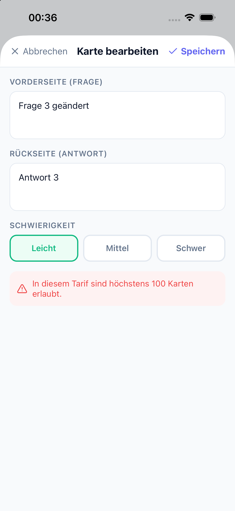
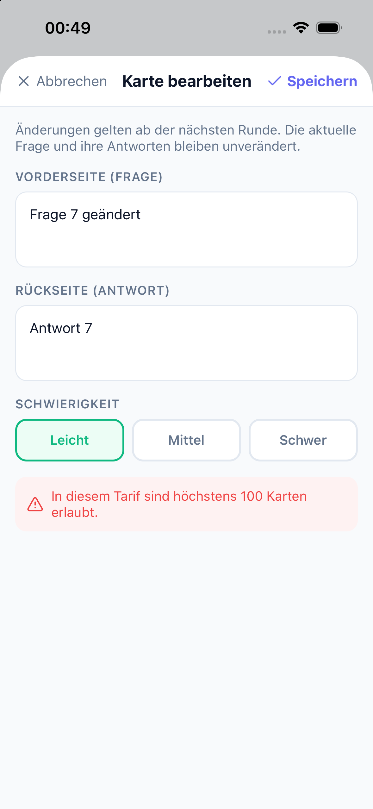
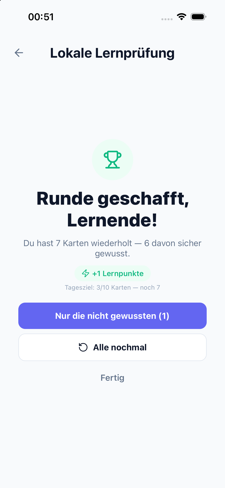

# Lernfortschritt und Karteneditor: Prüfung am 9. Oktober 2026

## Ergebnis und PR-Entscheidung

Basis: `origin/main` = `6a896da8e23613475bd8da1159c63ce076c3ce15`.
Isolierter Branch: `codex/learn-resume-editor-697-700`.

- **#736 nicht übernehmen:** Der Juli-Ansatz rekonstruiert die Runde aus aktuell fälligen Karten und alten Ergebnissen. Seit #745 (`857b48c`) hat main die robustere Momentaufnahme mit geordneten `cardIds`, vorherigen Ergebnissen, Filterung gelöschter Karten und dauerhafter Review-Warteschlange. Vorschlag: #736 als durch #745 ersetzt schließen. Dieser Branch ändert die Resume-Auflösung und den Background-Sync nicht.
- **#737 ersetzen:** Die kleinen Editor-Korrekturen wurden gegen das aktuelle main übertragen und zusätzlich an echten Fehlerstellen abgesichert. Keine alten kompletten Screen-Dateien übernommen. #737 kann nach Prüfung dieses Ersatzes geschlossen werden.
- **Zusätzlicher reproduzierter Lernfehler:** Bei der letzten Karte wartete `handleRate` auf den vorletzten HTTP-Request, bevor es den letzten Review registrierte. Die bereits sichtbare Zusammenfassung berechnete dadurch LP mit einer Karte zu wenig. Jetzt werden beide ausstehenden Reviews vor dem ersten `await` registriert. Frühere Resume-Ergebnisse werden dabei nicht erneut gesendet.

## Verhalten nach der Änderung

Die Textkarten-Editoren in Karteikarten, Lückentext, Quiz, Prüfung und Paare zeigen die gespeicherte Schwierigkeit. Sie speichern Vorderseite, Rückseite und Schwierigkeit zusammen. Ordner-Lernstarts behalten dafür die vollständigen Kartenobjekte. Ein fehlgeschlagener Request zeigt eine konkrete Tarifmeldung oder einen allgemeinen Retry-Hinweis; Text und Auswahl bleiben für einen erneuten Versuch erhalten. Stift, Stern und Schwierigkeitsauswahl haben Accessibility-Beschriftungen bzw. Auswahlzustände.

Quiz und Prüfung erklären, dass bereits erzeugte Fragen und Antworten erst in der nächsten Runde die Änderung übernehmen. Im Quiz liegt das Frage-Badge jetzt unter den Touchflächen von Stift und Stern: Der vorher im Simulator nicht erreichbare Stift öffnet den Editor wieder.

## Automatisierte Prüfung

Vor den Korrekturen wurden folgende Fehler reproduziert:

| Regression | Vorher | Nachher |
| --- | --- | --- |
| Editor-Anbindung: echte Schwierigkeit, PATCH, Fehlermeldung, Beschriftung | 15 fehlschlagende Tests | grün |
| Entwurf bleibt bei Saving-/Error-Rerender erhalten | 1 fehlgeschlagener Komponententest | 2 Komponententests grün |
| Ordner-Presets behalten die Schwierigkeit | 1 fehlschlagender Test | grün |
| Letzter Resume-Review wird vor langsamem HTTP registriert | 1 fehlschlagender Test | grün |
| Quiz-Stift durch Badge verdeckt | nativer Fehlversuch vor Layoutänderung protokolliert | Editor öffnet und Retry funktioniert |

`pnpm run ci` auf dem finalen Quellstand: **2.281 Tests bestanden**, **48 DB-abhängige API-Tests ohne lokale DATABASE_URL übersprungen**. Lint und Typecheck erfolgreich; 32 vorhandene ESLint-Warnungen, keine Fehler. Verteilung: contracts 20, testkit 26, web 483, API 837, mobile 911, domain 4.

Zusätzlich: 34 gezielte Resume-/Lifecycle-/Background-Tests und vier lokale Playwright-Resume-Szenarien bestanden. Die Browser-Szenarien verwenden abgefangene Test-Auth/API-Antworten. Der erste Browser-Start überschritt unter gleichzeitiger Maschinenlast das Startzeitlimit; der erneute Lauf mit laufendem lokalen Server bestand vollständig.

## Native iOS-Prüfung

Eigenes iPhone-15-Simulatorgerät, iOS 26.5. Eine vorhandene kompatible native Simulator-App wurde in einen eigenen Prüfbereich kopiert, mit aktuellem lokalem Release-JS gebündelt, ad-hoc signiert und ausschließlich auf dem neuen Simulator installiert. Kein EAS-Build. Auth, Daten und API sind synthetische Loopback-Fixtures (`127.0.0.1:17869`), keine Produktionskonten oder kostenpflichtigen Dienste.

Finales JS-Bundle SHA-256: `fb47f354c990286bef86b29ed256fee346b523e4d5aa8daa11a72f061a9f6209`.
Die finale Runde für Quiz und Resume wurde nach dem Quiz-Layout- und LP-Fix wiederholt. Die übrigen Editor-Flows liefen auf dem früheren Kandidaten mit identischem Editor-Code; die nachfolgenden Änderungen betrafen Quiz-Layout, den letzten Flashcard-Review und Ordner-Einstiege.

| Modus | Nativ abgeschlossener Ablauf | Fixture-Readback |
| --- | --- | --- |
| Karteikarten | Resume der ursprünglichen sieben Karten, alte Ergebnisse erhalten; Editor mit schwerer Karte, Text und Schwierigkeit geändert; 409 sichtbar, identischer Retry erfolgreich; Hintergrund und Prozessneustart; Runde vollständig beendet | ursprüngliche Kartenfolge; keine zusätzliche neu fällige Karte 8; Summary 7 Karten / 6 sicher / 1 Wiederholung |
| Lückentext | Resume bei Karte 3 von 7; Schwierigkeit geändert; 503 sichtbar, identischer Retry erfolgreich; restliche fünf Antworten bis Summary | 6 von 7 richtig einschließlich früherer Ergebnisse; Karte 8 ausgeschlossen |
| Quiz | Editor über Stift erreichbar; Änderungs-Hinweis; Text und Schwierigkeit geändert; 409 und erfolgreicher Retry; alle acht Fragen beantwortet | PATCH enthält Text und Schwierigkeit; aktuelle erzeugte Frage bleibt wie angekündigt unverändert; Summary 8/8 |
| Prüfung | Editor mit echter Schwierigkeit; Hinweis; 409 und erfolgreicher Retry; eine verbleibende Frage vollständig abgeschlossen | PATCH erfolgreich, Summary 1/1 = 100 % |
| Paare | sechs Paare bis Ergebnis; Ergebnis-Karteneditor, Schwierigkeit geändert; 503 sichtbar und erfolgreicher Retry | Summary sechs Paare / null Fehler; identischer erfolgreicher PATCH |

Bei jedem der fünf Editor-Flows wurde im API-Readback geprüft: Fehlerrequest und erfolgreicher Retry enthalten dieselbe Karten-ID, Vorderseite, Rückseite und Schwierigkeit.

**Finaler Resume-Abschluss:** vom gespeicherten Stand Karte 4 von 7 wurden genau die Karten 4–7 bewertet. Vier eindeutige Idempotency-Keys, kein erneutes Senden der drei alten Ergebnisse, `POST /lp/earn` mit `sessionCardCount: 4`; Flashcard-Fortschrittsmarker anschließend gelöscht. Die letzten zwei Requests dürfen in anderer Netzwerkreihenfolge ankommen; die Bildschirmfolge und ihre Review-Zeitpunkte bleiben 4, 5, 6, 7.

Der erste Background-Versuch traf eine noch fehlende `/learn/sync`-Route der lokalen Fixture (404). Die App behielt den Review über Prozessneustart und versuchte denselben Idempotency-Key erneut. Nach Ergänzung der Fixture wurde diese Operation angenommen. Das ist Nachweis der lokalen Warteschlange und ihres Retry-Verhaltens, keine Produktions-API-Abnahme.

## Sichtbare Belege







## Reproduktion und Nachweisablage

Fixture starten, vom Repository-Root:

```sh
node apps/mobile/scripts/learning-qa-fixture.mjs /tmp/clearn-learning-qa.ndjson
curl -s -X POST http://127.0.0.1:17869/qa/reset -H 'Content-Type: application/json' -d '{"resume":true}'
curl -s -X POST http://127.0.0.1:17869/qa/save-error -H 'Content-Type: application/json' -d '{"code":"DECK_FULL"}'
curl -s http://127.0.0.1:17869/qa/state
```

Für die lokale native App API und Supabase jeweils auf `http://127.0.0.1:17869` setzen, Anon-Key `local-fixture`, Testanmeldung `qa@clearn.local` / `local-test-only`. Die Fixture lauscht ausschließlich auf Loopback. `UNAVAILABLE` an `/qa/save-error` liefert einmalig 503; `/qa/delete-card` entfernt eine Karte anhand ihrer `id`. Optionales zweites Argument nach dem Logpfad stellt einen JSON-Zustand wieder her. Auth-Request-Inhalte werden nicht protokolliert.

Vollständige lokale Logs, JSON-Readbacks, Screenshots und Simulator-App: `/Users/andreas/Documents/Codex/clearn-learn-qa-2026-10-09/`. Red-/Green-Logs: `editor-wiring-red.log`, `editor-draft-red.log`, `folder-difficulty-red.log`, `last-review-red.log`, `last-review-green.log`, `ci-final2.log`, `resume-unit.log`, `resume-browser-retry.log`. Native Readbacks unter `native/*-complete.json` und `native/resume-final.json`.

## Offene Abnahmegrenzen

- #697 und #700 bleiben offen: kein echtes Web↔Telefon-Gerätewechsel-Szenario, keine produktive Auth/API-Abnahme, keine Store- oder physische Geräteprüfung. Gelöschte Karten sind durch bestehende Resolver-Tests geprüft, nicht durch einen zusätzlichen nativen Löschlauf.
- #697: Herkunft-/Zeitpunktanzeige eines Fortsetzen-Stands ist weiterhin ein offener UX-Punkt. Vorhandene September-Migration heißt `20260927222222_session_progress_card_ids.sql`; ihr Produktionsstatus wurde hier nicht neu geprüft.
- #700: Paare hat den Karteneditor im Ergebnisbereich. Bild-Verdecken nutzt den bestehenden separaten Bild-/Regioneneditor über „Deine Bilder“; Inline-Bearbeitung von Regionen während einer laufenden Runde wurde hier nicht ergänzt oder abgenommen. Einen Texteditor auf den serialisierten Occlusion-Payload anzuwenden wäre keine sichere Lösung.
- Das Tagesziel auf der Flashcard-Summary kann trotz vier angenommenen Reviews noch 3/10 anzeigen. Dies ist der bereits in #703 verfolgte getrennte Stats-Abruf vor Abschluss aller Requests. Der hier korrigierte LP-Request enthält nachweislich vier Karten; #703 bleibt davon unabhängig offen.
- Keine Änderungen an API, LP-Werten, Berechtigungen, Secrets oder Produktionsdaten. Kein Merge, Deployment, Security-Scan, EAS-Build oder Issue-Schließen.
