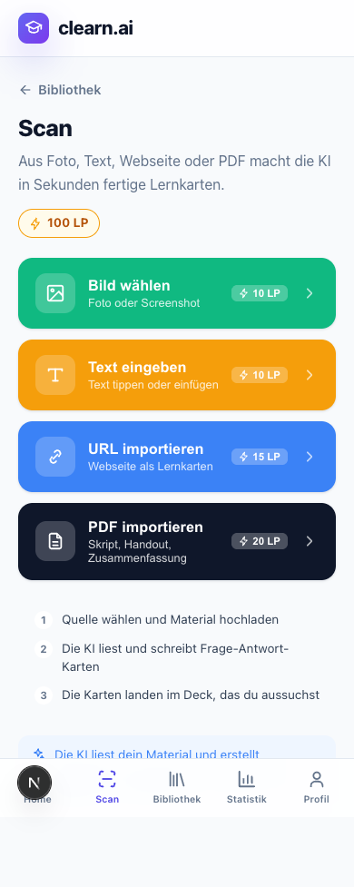
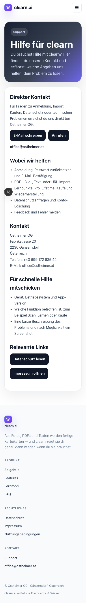

# Scan-Texte und Copy-Reste – 09.10.2026

Begrenzter Folgeauftrag zu #729, #703 und #84. Ausgangspunkt: `origin/main` bei `6a896da8e23613475bd8da1159c63ce076c3ce15`. Der Audit-PR #757 bleibt separat.

## Wortlaute

`packages/contracts/src/importCopy.ts` liefert gemeinsame deutsche und englische Scan-Texte. Das deutsche Web verwendet dieselben Texte wie die App; die App bindet beide Sprachen über `resources.ts` ein. Das Web hat weiterhin keine englische Sprachumschaltung.

| Punkt aus #729 | Deutscher Wortlaut |
| --- | --- |
| Foto / Galerie | „Foto aufnehmen / Lehrbuch, Tafel, Notizen“; „Bild wählen / Foto oder Screenshot“ |
| URL / PDF / Text | „Webseite als Lernkarten“; „Skript, Handout, Zusammenfassung“; „Text tippen oder einfügen“ |
| Info | „Die KI liest dein Material und erstellt automatisch Lernkarten aus Fotos, Text, Webseiten oder PDFs.“ |
| Erzeugen | „Karten erstellen“ |
| Laden | „Karten werden erstellt…“ / „Karten werden gespeichert…“ |
| Zurück | „Andere Quelle wählen“ |
| Ziel-Deck | Bekannte freie Plätze immer anzeigen; „1 Platz frei“, „90 Plätze frei“, „voll“. Unbekannte Grenze bleibt ohne Zahl. |

Die native Deck-Auswahl behält ihren Titel und ihre zweite Zeile mit Kartenanzahl und Platzhinweis. Volle Decks bleiben gesperrt. Grenzen, Preise, LP-Abzüge und Scan-Abläufe sind unverändert.

Support verwendet verständliche Hilfe-Texte statt App-Store-/Entwicklersprache. Der leere Lernbildschirm sagt „Scanne Lernmaterial, um Karten zu erstellen.“ / „Scan study material to create cards.“

README und Monetarisierungskonzept nennen Lifetime als angeboten. [Apples öffentliche Kaufübersicht](https://apps.apple.com/us/app/clearn/id6766691399) nennt den Lifetime-Kauf. Der tatsächliche Kaufdialog lädt weiterhin den lokalisierten Store-Preis aus RevenueCat; weder Preis noch LP-Regel wurden geändert. Die öffentliche Liste beweist keinen erfolgreichen Kauf oder Restore.

## Lokale Prüfung

- Zuerst roter Regressionstest: Bei 90 freien Plätzen lieferte `deckSlotsHint` noch `null`. Nach Korrektur sind auch Singular, voll, unbekannte Grenze und englische Hinweise geprüft.
- Bestehende Ressourcen-/Import-Guards: 88 Tests grün.
- Bestehender gemounteter Scan-Lifecycle-Test verwendet echte Übersetzungen; zusätzlich DE/EN-Quellenauswahl, Textansicht und Zurückweg geprüft.
- Browser-Prüfung bei 1440 und 390 Pixeln: Support, Quellen-Texte, Zurückweg, Erzeugen-/Ladetext und „Biologie · 90 Plätze frei“ geprüft; keine Seitenfehler. Authentifizierung und API einschließlich Scan-Ergebnis waren synthetische lokale Fixtures. Keine echte KI-Anfrage, keine Speicherung auf einem Backend.
- Lokaler iOS-Export mit Expo erfolgreich (`expo export --platform ios`), kein EAS-Build. Das belegt Bündelbarkeit, keine Geräteabnahme.

## Verbleibend

Redaktionelle Abnahme der vorgeschlagenen Sätze, anschließend koordinierter Merge/Deployment und Geräteprüfung der nächsten gebündelten App-Version. Bestehende Store-Builds enthalten diese Änderung noch nicht.

#733 bleibt beim Scan-Worker. Gemeinsame Datei: `apps/mobile/app/(tabs)/scan.tsx`; dieser PR ersetzt dort ausschließlich sichtbare Texte durch `t("scan.*")`. Gemeinsame Texte und Grenzen liegen separat. Bei Integration auch den Lifecycle-Test beachten, dessen Sprach-Mock jetzt echte Ressourcen verwendet.

Die funktionalen Restpunkte von #703 sowie offene Wirtschaftsentscheidungen/Abnahmegates von #84 sind nicht Teil dieses Copy-PRs. Kein Issue wird automatisch geschlossen.
