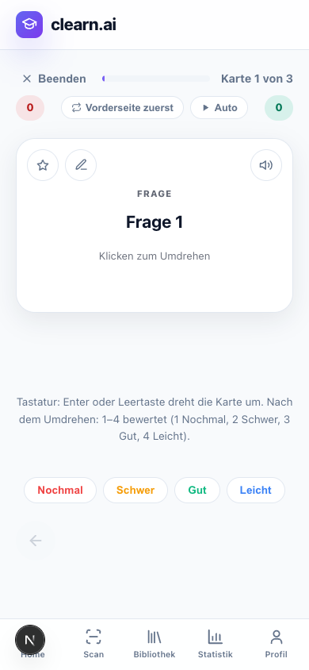
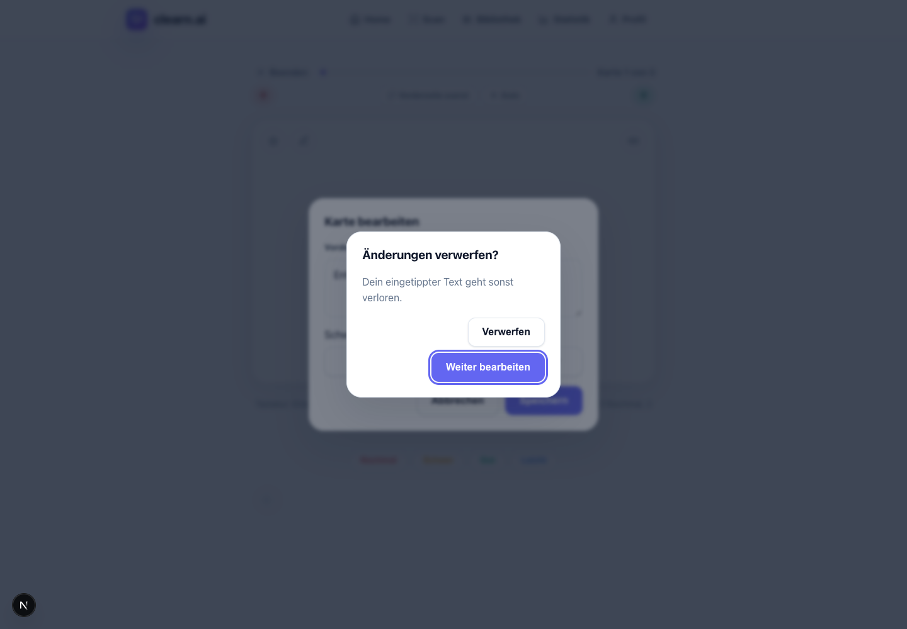

# #703: Web-Tastatur und Dialoge – 9. Oktober 2026

## Umfang und Quellstand

Dieses Paket behandelt die sechs Bedienungspunkte am Anfang von [#703](https://github.com/ostheimer/cloudlearn/issues/703). Ausgangsbasis war `6a896da`; vor der abschließenden Prüfung wurde der neue isolierte Branch `codex/web-keyboard-dialogs-703` konfliktfrei auf `4d6711d` rebasiert. Geprüfter Implementierungscommit: `347b660de253f861c5de5e67dd4ed6352ff54458`.

#759 und dessen Worktree wurden nicht geändert. Die seitdem übernommenen Mobile-/API-/Copy-Korrekturen kommen ausschließlich aus main. Quiz, Match und Occlusion bleiben beim Web-Bild-Paket; deren Dateien wurden nicht bearbeitet. Gemeinsame Änderungen sind auf `Modal`, `CardEditor`, `FolderCard`, die beiden Menü-Verbraucher sowie 18 CSS-Zeilen für den eigenen Umdreh-Knopf beschränkt.

## Fehler und Korrekturen

| Punkt | Roter Verhaltenstest | Geprüftes Verhalten nach dem Fix |
| --- | --- | --- |
| Editor offen, Ratings 1–4 | Ziffern auf dem Schwierigkeitsknopf und auf dem Dialogcontainer wechselten die darunterliegende Karte | Der Editor hält den Lernstand; kein Review wird gesendet. Normale Ratings auf dem Umdreh-Knopf bleiben möglich. Andere Knöpfe/Links und editierbare Felder behalten ihre eigenen Tasten. |
| Editor offen, Cloze Enter | Enter in der Editor-Textarea führte zur nächsten Lernkarte und schluckte den Zeilenumbruch | Der Zeilenumbruch bleibt im Entwurf; die beantwortete Karte bleibt sichtbar. Der globale Enter-Horcher pausiert während der Bearbeitung. |
| Kürzel nur im Tooltip | Sichtbare Tastaturhilfe nicht vorhanden | Enter/Leertaste und 1–4 mit allen vier Bewertungsnamen stehen dauerhaft unter der Karte; der Umdreh-Knopf verweist über `aria-describedby` darauf. |
| Home-Fällig-Pille | Die Pille wurde durch Tab nicht erreicht | Ein echter Link führt per Tab/Enter zur globalen Lernseite. Bibliothek und fällige Runde sind Geschwister-Links; keine verschachtelten Links. |
| Menüs bei Tab/Focus-out | Bibliotheks- und Unterordner-Menüs blieben jeweils offen | Tab verlässt und schließt das Menü, Focus-out schließt ebenfalls. Pfeile/Home/End navigieren weiterhin; Escape schließt mit Fokus am Auslöser. Menüeinträge sind mit Pfeilen erreichbar und aus der normalen Tabfolge genommen. |
| Verwerfen und Button-Semantik | Tab sprang aus der Nachfrage in den Editor; Lernkarte hatte drei Knöpfe in ihrer Button-Rolle | Eigener `alertdialog`, eigene Falle, Fokus zuerst auf „Weiter bearbeiten“. Der Editor ist währenddessen inert und aus dem Accessibility-Tree genommen. Escape kehrt mit unverändertem Entwurf zurück; Verwerfen schließt und gibt den Fokus zum Stift zurück. Die Karte hat einen eigenen nativen Umdreh-Knopf neben Stern/Stift/Vorlesen. Nur die sichtbare Kartenseite ist im Accessibility-Snapshot enthalten. |

## Beweisfolge

1. `learn-keys-red.log`: zwei Logiktests rot, acht vorhandene Fälle grün.
2. `keyboard-red-node24.log`: zehn Browserfälle rot, vollständige Tastatur-Karteikartenrunde als positiver Kontrollfall grün. Die Fehler waren konkrete UI-/Fokus-/Fortschritts-Assertions.
3. `dialog-semantic-red.log`: zusätzlicher Dialogcontainer-Fall rot; präzisierte Verschachtelungsprüfung meldet **drei** untergeordnete Buttons statt null. Derselbe Test prüft nach dem Fix null, getrennte Aktionen und den sichtbaren Karteninhalt im Accessibility-Snapshot.
4. `keyboard-green-desktop.log`: zwölf ursprüngliche/verfeinerte Fälle grün.
5. Erweiterung um Fokus-Rückkehr nach bestätigtem Verwerfen: konkreter Fehlversuch im ersten Matrixlauf (`keyboard-matrix.log`). Die Falle wurde vom endgültigen Fokus-Rückweg getrennt. Derselbe Test ist in `discard-return-green.log` grün; er bleibt Teil der finalen Matrix.
6. Finale unveränderte Verhaltenserwartungen in `keyboard-final.log`: **52/52 bestanden** (13 Szenarien × vier Profile), einschließlich vollständiger Karteikarten- und Cloze-Runden. Jeder Fall prüft keine Page-Errors, keine unerwarteten API-/externen Requests und keine horizontale Überbreite.

Die Screenshots zeigen den tatsächlich geprüften lokalen Zustand:





## Locale-, Browser- und Datenumfang

Chrome/Playwright, Viewports **1440 × 1000** und **390 × 844**, jeweils Browser-Locale **de-DE** und **en-US**. Mobilbreite ist eine Layout-/Tastaturprüfung, kein physisches Mobilgerät. Die Screenreader-Semantik wurde anhand Rollen, Namen, Zuständen, Fokus und Chromium-Accessibility-Snapshots geprüft; keine VoiceOver-/NVDA-Audioabnahme behauptet.

Das Dashboard hat derzeit keinen Sprachschalter, seine Texte sind deutsch und das Dokument trägt `lang="de"`. en-US prüft daher englische Browser-Locale bei derselben deutschen Oberfläche, keine englische Übersetzung. Die neue Hilfe verwendet echte Umlaute.

Alle Auth-/API-Antworten sind synthetisch und abgefangen. Eigener Loopback-Port **4193**, keine echten Konten, keine Produktionsdaten, kein KI-Aufruf. Die Tests brechen externe Requests ab und melden unbekannte Routen als Fehler.

## CI und Wiederholung

`pnpm run ci` nach Rebase und aktualisierter Frozen-Lockfile-Installation: **2.342 Tests bestanden**, **49 API-DB-Integrationstests ohne lokale DATABASE_URL übersprungen**. Aufteilung: contracts 20, testkit 26, web 484, API 895, mobile 913, domain 4. Lint/Typechecks bestanden; 32 bestehende ESLint-Warnungen, keine Fehler. Log: `ci-final.log`.

Der erste Browserstart unter Node 26 hing vor der ersten eigentlichen UI-Prüfung und wurde beendet (`keyboard-red.log`). Die reproduzierenden und finalen Läufe verwenden das bereits installierte Node 24. Ein erster CI-Versuch nach dem Rebase fand die neu hinzugekommene `@clearn/contracts`-Workspace-Verknüpfung noch nicht (`ci-rebased.log`); nach `pnpm install --frozen-lockfile` bestanden dieselben Checks. Beides sind Setup-Probleme, keine hier behaupteten Produktfehler.

Wiederholung vom Repository-Root:

```sh
pnpm install --frozen-lockfile
pnpm run ci
pnpm exec playwright test -c playwright.keyboard.config.ts
```

Auf dieser Maschine wird für die letzten zwei Befehle `PATH=/opt/homebrew/opt/node@24/bin:$PATH` gesetzt. Chrome muss installiert sein. Die neue Playwright-Suite ist gezielte lokale QA; der bestehende GitHub-CI-Workflow wird nicht umgeschrieben und führt sie nicht automatisch aus.

Vollständige lokale Logs und rote Browser-Traces: `/Users/andreas/Documents/Codex/clearn-web-keyboard-qa-2026-10-09/`. Finale Screenshots/Accessibility-Anhänge entstehen in `test-results/`; die ausgewählten Screenshots sind oben versioniert.

## Verbleibende #703-Arbeit

#703 bleibt offen. Dieses Paket korrigiert ausschließlich die genannten Web-Bedienungspunkte. Weiterhin separat sind Tagesziel-Abruf gegen den letzten Review, Such-Cap/Sortierung/Trefferzahl, doppelte Setup-Zahlen, verbleibende Support-/App-Leertext-Copy, Ordner-Offlinenachricht/Due-Ausweg/Gruppierung/Mengen- und Unterordner-Semantik, Meilenstein-Balance/Feier/Bonus-Historie, „Fast“-Darstellung/Sprachausgabe/Prüfungsparität, gerätelokale Setups samt Reset-/Zuletzt-Hinweis sowie die belegten Aufräum-/Duplikatpunkte. Die frühere Ordner-Deckzuordnung wird bereits durch #759 mit vollständigen Kartenobjekten erhalten; hier kein zusätzlicher Mobile-Fix.

Für die vollständige zeilenweise Abgrenzung siehe [Auditmatrix #703](../audits/2026-10-09-open-issue-abgleich.md). Schon korrigierte/widerlegte Punkte aus #723/#724/#725 werden durch dieses Paket nicht erneut beansprucht. Keine Issue-Autoschließung, kein Merge, Produktionsdeployment, Security-Scan oder EAS-Build.
